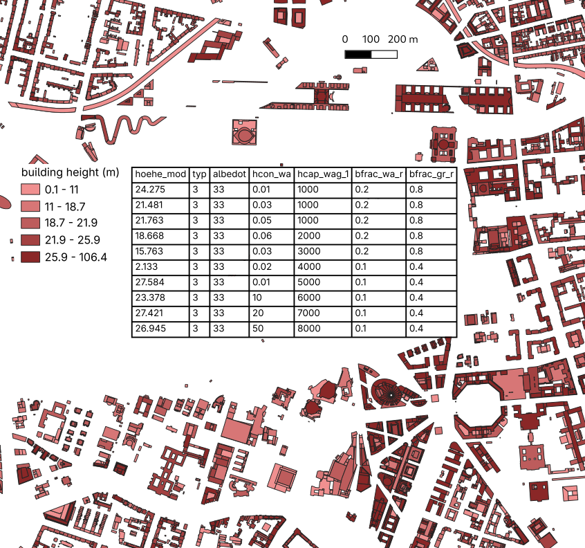
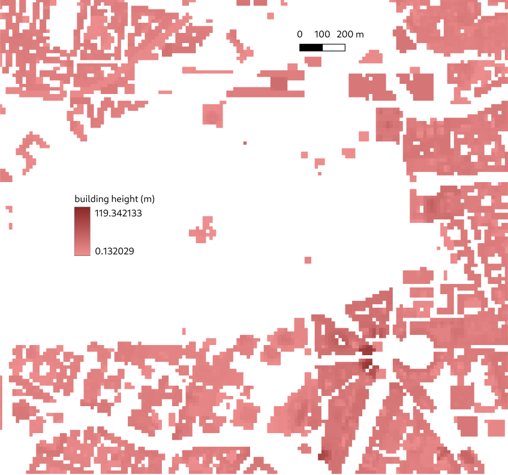

# Buildings

Buildings from 2d data

---

For `palm_csd` each building (pixel) is defined by a building height, a [building type](types.md#building-type) and a building id. The latter is used to identify all the pixels belonging to the same building.

  
*Buildings vector polygons and their attributes building height (hoehe_mod) and building type (typ).*

If the building input is given as a vector polygon file, at least the building height column [`buildings_2d`](yaml.md#buildings_2d) needs to be specified. All polygons with a missing building height are ignored. Optionally, the columns [`building_type`](yaml.md#building_type) and [`building_id`](yaml.md#building_id) can be specified. If the building type is not given, it is set to 2 or `residential_1951_2000`. If the building id is not given, it is *automatically* generated with a different value for each polygon.

```yaml
input:
  files:
    surfaces: buildings.shp
  columns:
    hoehe_mod: buildings_2d
    typ: building_type
```

  
*Building height raster.*

If the building input is given as raster files, both, the building height and the building id need to be specified as `palm_csd` cannot identify separate buildings from the raster data. The building type can be specified as well, but if it is not given, it is set to 2 or `residential_1951_2000`.

```yaml
input:
  files:
    buildings_2d: buildings_height.tif
    building_id: buildings_id.tif
    building_type: buildings_type.tif
```

In addition to 2d buildings, `palm_csd` supports bridge-like structures. These are defined by its upper height and its structural depth [`bridge_depth`](yaml.md#bridge_depth). `bridge_depth` is set for the entire domain. Similar to the standard buildings, the bridge height can be given as a column in a vector polygon file mapped to `bridges_2d` or as the raster file [`bridges_2d`](yaml.md#bridges_2d). In the latter case, the IDs are required to be defined by [`bridges_id`](yaml.md#bridges_id) whereas in the former case, the `bridges_id` column is optional. The [building type](types.md#building-type) of a bridge is set to 7 or `bridges`.

```yaml
input:
  files:
    surfaces: bridges.shp
  columns:
    height2: bridges_2d
domain:
  input: root
  bridges_depth: 5.0
```

or

```yaml
input:
  files:
    bridges_2d: bridges_height.tif
    bridges_id: bridges_id.tif
domain:
  input: root
  bridges_depth: 5.0
```

When bridges are present in the domain, the generated static driver will include the additional field `buildings_3d`, a 3d representation of the buildings, which is required to represent the airspace below the bridges. In order to add this field also when no bridges are present, set [`buildings_3d`](yaml.md#buildings_3d) to `True`. While `buildings_3d` does not add additional information compared to `buildings_2d` in this case, it can simplify for example the 3d visualization of the domain.

## Clearance zone at domain borders

`palm_csd` can ensure that a clearance zone at the borders of the domain is building-free to enhance the stability of the PALM run. Setting [`building_free_border_width`](yaml.md#building_free_border_width) to a positive value will remove all buildings within this distance from the domain borders and replace them with the [pavement type](types.md#pavement_type) defined by [`building_free_border_pavement_type`](yaml.md#building_free_border_pavement_type).

## Setting of building parameters

PALM's building parameters such as building surface albedo, building vegetation cover or building thermal properties are supplied in the static driver in separate variables with distinct dimensions. In `palm_csd`, these parameters can be supplied as attributes to building polygons, as raster files for individual grid cells and as domain-wide values in the configuration file.

### Available building parameters and domain-wide defaults

Building parameters in PALM are definied with different dimensions. [`building_heat_capacity`](yaml.md#building_heat_capacity), [`building_heat_conductivity`](yaml.md#building_heat_conductivity) and [`building_thickness`](yaml.md#building_thickness) are defined for each [building surface type](types.md#building_surface_type) and each layer. The urban surface types describe the different fractions for wall, window, green at the different heights ground floor (`<fraction>_gfl`), above ground floor (`<fraction>_agfl`) and `<fraction>_roof`. Each of these urban surface types has four layers to represent the heat conduction and storage in the surfaces and thus in building.

[`building_albedo_type`](yaml.md#building_albedo_type), [`building_emissivity`](yaml.md#building_emissivity) and [`building_fraction`](yaml.md#building_fraction) are also defined for each [building surface type](types.md#building_surface_type) but, since they describe surface properties or the while fraction of the urban surface, they do not have a layer dimension.

[`building_lai`](yaml.md#building_lai), [`building_roughness_length`](yaml.md#building_roughness_length) and [`building_roughness_length_qh`](yaml.md#building_roughness_length_qh) are independent of the specific urban surface fraction and can thus only be set for each [building surface level](types.md#building_surface_level) `gfl`, `agfl` and `roof`.

[`building_general_pars`](yaml.md#building_general_pars) and [`building_indoor_pars`](yaml.md#building_indoor_pars) are a collection of parameters and have thus their own dimension [`building_general_pars`](yaml.md#building_general_pars) and [`building_indoor_pars`](yaml.md#building_indoor_pars), respectively.

The setting of the building parameters is given using a `setting: input value` structure. The possible `setting`s are the aforementioned dimension. Note that also parts of these defined strings are allowed. For example, for `building_fraction`, a `window` setting will apply to `window_gfl`, `window_agfl` and `window_roof`.

The `input value`s can be either a single value or, in the case of parameters that describe the layers of an urban surface, a list of four values. These four values represent the four urban surface layers in PALM, beginning from the outermost layer. If only a single value is supplied for parameters of urban surface layers, this single values will be applied to all urban surfaces. In addition, it is also possible to set the value directly to the parameter, which will be expanded to all applicable settings.

Here are some examples:  
One value set for a parameter like

```yml
domain:
  building_heat_conductivity: 1.8
```

will be expanded to

```yml
domain:
  building_heat_conductivity:
    wall_gfl: [1.8, 1.8, 1.8, 1.8]
    wall_agfl: [1.8, 1.8, 1.8, 1.8]
    wall_roof: [1.8, 1.8, 1.8, 1.8]
    window_gfl: [1.8, 1.8, 1.8, 1.8]
    window_agfl: [1.8, 1.8, 1.8, 1.8]
    window_roof: [1.8, 1.8, 1.8, 1.8]
    green_gfl: [1.8, 1.8, 1.8, 1.8]
    green_agfl: [1.8, 1.8, 1.8, 1.8]
    green_roof: [1.8, 1.8, 1.8, 1.8]
```

In the case of a parameter that sets urban surface layer properties, also a list of four values like

```yml
domain:
  building_heat_conductivity: [1.6, 1.7, 1.8, 1.9]
```

will be expanded to

```yml
domain:
  building_heat_conductivity:
    wall_gfl: [1.6, 1.7, 1.8, 1.9]
    wall_agfl: [1.6, 1.7, 1.8, 1.9]
    wall_roof: [1.6, 1.7, 1.8, 1.9]
    window_gfl: [1.6, 1.7, 1.8, 1.9]
    window_agfl: [1.6, 1.7, 1.8, 1.9]
    window_roof: [1.6, 1.7, 1.8, 1.9]
    green_gfl: [1.6, 1.7, 1.8, 1.9]
    green_agfl: [1.6, 1.7, 1.8, 1.9]
    green_roof: [1.6, 1.7, 1.8, 1.9]
```

A partial setting like

```yml
domain:
  building_heat_conductivity:
    wall: 1.8
```

will be expanded to

```yml
domain:
  building_heat_conductivity:
    wall_gfl: [1.8, 1.8, 1.8, 1.8]
    wall_agfl: [1.8, 1.8, 1.8, 1.8]
    wall_roof: [1.8, 1.8, 1.8, 1.8]
```

### Overriding building parameters with input data

Building parameters set in the configuration file can be overridden by supplying the respective attribute in the building polygons or by providing raster data for individual grid cells. The nomenclature for the attribute names and raster file keys is similar to the one used in the configuration file.

For example, setting the `building_heat_capacity_wall_agfl_1` attribute or supplying the respective raster data will set the heat capacity of the 1st layer of all wall elements above ground floor. More generally, setting `building_heat_conductivity_wall` will define the heat conductivity of all layers of all wall materials (ground floor, above ground floor and roof).

Thus, for vector input, the configuration would look like this:

```yaml
input:
  files:
    surfaces: buildings.shp
  columns:
    hcap_wag_1: building_heat_capacity_wall_agfl_1
    hcon_wa: building_heat_conductivity_wall
```

and for raster input like this:

```yaml
input:
  files:
    building_heat_capacity_wall_agfl_1: hcap_wag_1.tif
    building_heat_conductivity_wall: hcon_wa.tif
```

The building parameters supplied in the input data have precedence over the domain-wide defaults set in the configuration file.
