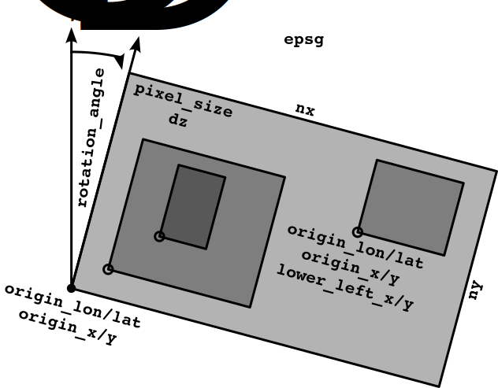

# Domain set-up, input files and their geographic processing

General set-up of domains, collection of input files and their GIS-related processing

---

`palm_csd` supports the generation of a root domain and an arbitrary number of nested domains. It checks for sufficient space at the borders of the domains to the respective parent domain and for an overlap of the domains. If domains overlap, only one-way nesting is allowed. This page describes how to set up the domains and define input files for them. It also describes the GIS-related processing of the input files that `palm_csd` applies.

## Domain set-up

  
*Illustration of nested domains. The rotation_angle describes the angle between the projected coordinate system's north $N_\mathrm{C}$ and the north of the domain $N_\mathrm{D}$. Together with `epsg`, it is applied to all domains. The other parameters are set on a per-domain basis.*

All domains share one target coordinate system, which is set with [`epsg`](yaml.md#epsg), and one [`rotation_angle`](yaml.md#rotation_angle). The latter is the angle between the projected coordinate system's north axis $N_\mathrm{C}$ and the domain's north axis $N_\mathrm{D}$. The input data, when in a georeferenced format as described below, will be automatically reprojected and the rotation angle will be applied. This allows datasets with varying input projections to be used without manual conversion, reducing preprocessing effort and ensuring a consistent final projection.

For each domain, create a separate [`domain` section](yaml.md#domain-sections) of the form `domain_<name>`. In each section, set the parent domain with [`domain_parent`](yaml.md#domain_parent) and an entry like `domain_parent: <name>`. The position of the domain is set by the coordinates of the lower-left corner of the domain either in longitude/latitude system WGS84 with [`origin_lon`](yaml.md#origin_lon) and [`origin_lat`](yaml.md#origin_lat), or in the target coordinate system with [`origin_x`](yaml.md#origin_x) and [`origin_y`](yaml.md#origin_y). For nested domains, `palm_csd` will ensure that the nest aligns with its parent by slightly adjusting `origin_lon/lat` or `origin_x/y`. It will also calculate the distance [`lower_left_x`](yaml.md#lower_left_x) and [`lower_left_y`](yaml.md#lower_left_y) to the lower-left corner of the root parent domain, which is needed for the set-up of nesting in PALM. Alternatively, you can set the [`lower_left_x`](yaml.md#lower_left_x) and [`lower_left_y`](yaml.md#lower_left_y) directly, without specifying `origin_lon/lat` or `origin_x/y` of the nest.

Furthermore, each domain is characterized by its number of grid points in the horizontal and vertical directions, [`nx`](yaml.md#nx)+1 and [`ny`](yaml.md#ny)+1, as well as the [`pixel_size`](yaml.md#pixel_size) (`dx` and `dy` in PALM) and [`dz`](yaml.md#dz).

Input files are specified in [`input` sections](yaml.md#input-sections) of the form `input_<iname>`. The data of an input section that should be used for a domain is set by [input](yaml.md#input) with an entry `input: <iname>` in the respective `domain` section. If there is only one input section, [`input`](yaml.md#input) can be omitted.

## Input files

`palm_csd` supports a variety of input file formats, including 2D raster data (e.g., vegetation height, albedo) and vector data (e.g., single trees, surface types). The input files can be in georeferenced formats such as GeoTIFF for rasters or ESRI Shapefiles for vectors.

In each [`input` section](yaml.md#input-sections), single 2d raster input files are specified by `file_<fname>`, e.g. [`file_vegetation_height`](yaml.md#file_vegetation_height), with paths relative to the input folder [`path`](yaml.md#path-1). Vector data can be supplied with two parameters: for point-based [single trees](vegetation.md#single-trees) with [`trees`](yaml.md#trees) or for polygon-based surface input with [`surfaces`](yaml.md#surfaces). Both, [`trees`](yaml.md#trees) and [`surfaces`](yaml.md#surfaces), allow to specify one file path or a list of file paths.

The attributes/columns of the vector input files are mapped to surface types using `columns`. Here, there are two options: If a column represents a single input type, it can be specified as `<column_name>: <type_name>`. If a column contains multiple types, these entries can be mapped to the respective surface type using a dictionary of the form

```yaml
<column_name>:
    <value_1>: <type_name_1>
    <value_2>: <type_name_2>
    ...
```

For example:

```yaml
input_1:
  trees:
    - park_trees.shp
    - street_trees.shp
  surfaces: alkis.shp
  ...
```

## Choice of scaling methods

With [`downscaling_method`](yaml.md#downscaling_method) and [`upscaling_method`](yaml.md#upscaling_method), the resampling algorithm can be chosen for the downscaling and upscaling of the input data when reprojecting or changing the grid.

| Type | Examples | Downscaling default | Upscaling default |
| ---- | -------- | ------------------- | ----------------- |
|`categorical` | building type, pavement type, soil type, street type, vegetation type, water type | `nearest` | `mode` |
|`continuous` | terrain height, water temperature | `bilinear` | `average` |
|`discontinuous` | building height, bridge height, leaf area index, vegetation height | `nearest` | `average` |
|`discrete` | single tree properties except tree type | `nearest` | `average` |

Note that the scaling of `discrete` single tree raster data does not guarantee to preserve single point quantities. Thus, it is recommended to supply this input data on the target grid or in form of point vector data. In order to preserve the values in the `categorical` data, only `nearest` and `mode` is allowed. For all other data types, all [algorithms supported by rasterio](https://rasterio.readthedocs.io/en/stable/api/rasterio.enums.html#rasterio.enums.Resampling) can be chosen.

The methods can be either set as a dictionary of the form `type: method` or as a single string. If a string is provided, the method is used for all types. If a dictionary is provided, the method is used for the respective type. If a method is not provided for a type, the default method is used.

Note that the different methods handle missing values differently. While `nearest` produces a missing value when the centre of the target pixel is closest to a missing value in the source data, the other methods calculate values as soon as a part of the target pixel is covered by a non-missing pixel in the source data. In order to ensure consistency between the different data types, the missing values of `nearest` are applied to all data types.
