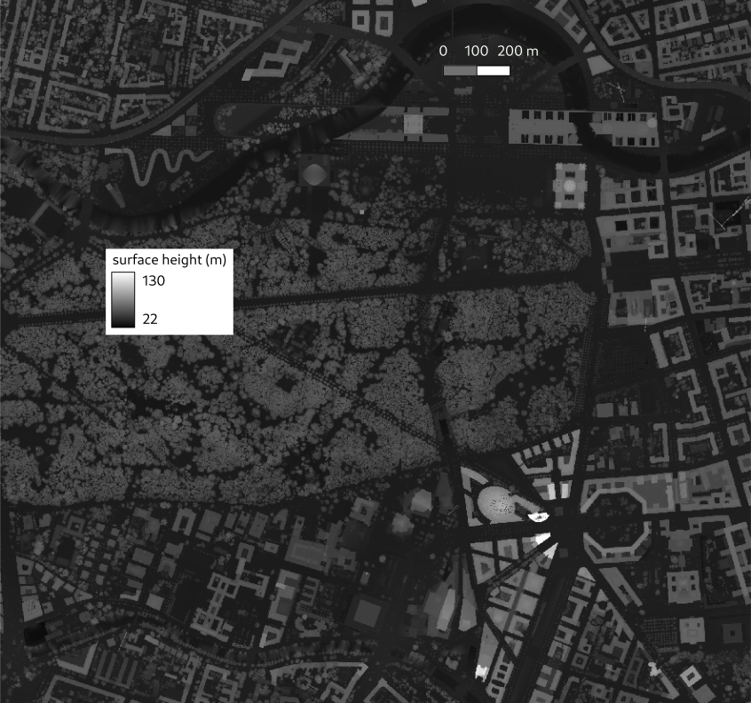
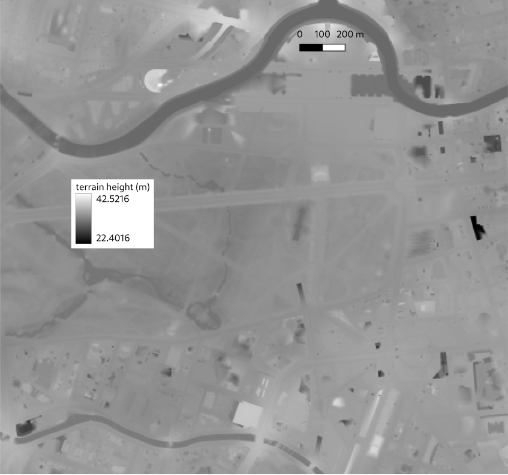
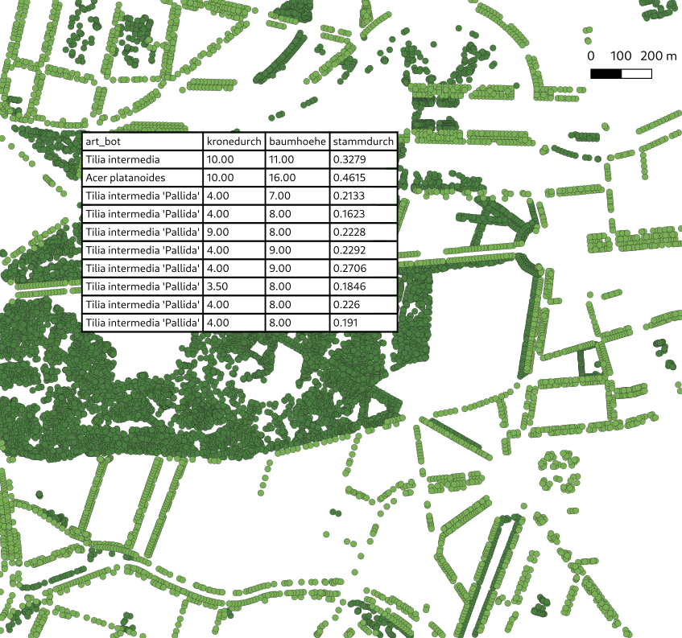
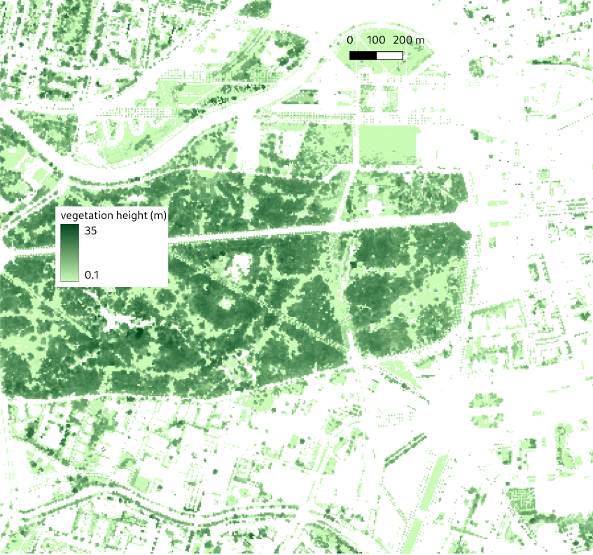
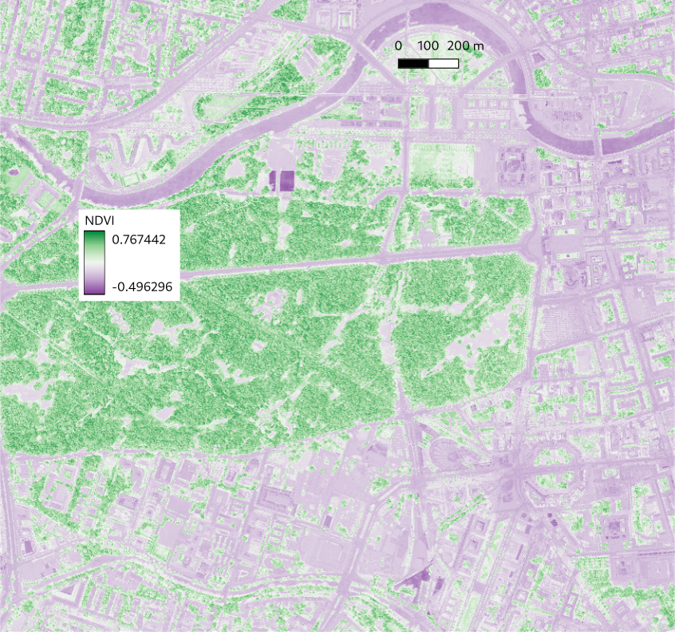
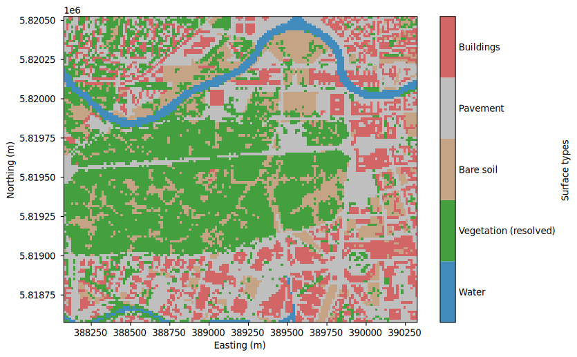
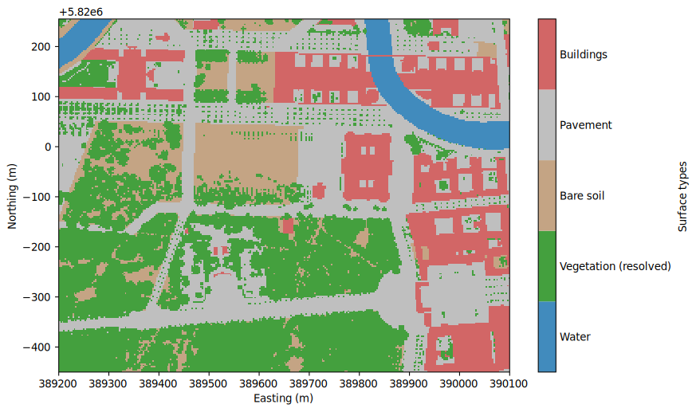

# Processing example: Berlin, Germany

A practical example of setting up and processing data for a specific city using `palm_csd`

---

This section shows the required preprocessing steps for the data of the city of Berlin, Germany, as well as the set-up of `palm_csd` for that data. The input data is freely available from the [Geoportal](https://www.berlin.de/sen/sbw/stadtdaten/geoportal/) and the [Umweltatlas](https://www.berlin.de/umweltatlas/). While most of the processing steps are done by `palm_csd`, some preprocessing is required using GIS tools of the user's choice, for example with the open-source tool [QGIS](https://qgis.org/). Its routines are mentioned in the following. The respective part of the `palm_csd` configuration is listed in each section, while the [complete configuration](#full-palm_csd-configuration) is shown at the end.

## Buildings

[Building information](buildings.md) is generated from building height, building type and building ID data.

  
*Aim of this step: Buildings vector polygons and their attributes building height (hoehe_mod) and building type (typ).*

The building height data for Berlin consists of vector polygons representing the building footprints, along with their attributes such as building height. Very few building heights were missing. The simplest solution is to assign a constant building height for the missing values. Use the QGIS' `Field Calculator` in the attribute table to create a new field with expression

```sql
case
  when "hoehe" is NULL then 20
  else "hoehe"
end
```

to fill in a default height of 20m for those buildings where the height is NULL.

Alternatively, if a normalized Digital Surface Model (nDSM) raster is available, the height can be derived from it. A nDSM represents the height of objects above the ground level and can be calculated from a non-normalized DSM (object height above sea level) raster subtracted by a Digital Terrain Model (DTM, terrain height above sea level) raster.

  
*Non-normalizedDigital Surface Model from 2021.*

  
*Digital Terrain Model from 2021.*

Averages over each building polygon yield the required building heights. In QGIS, both steps are done with the `Raster calculator` and the `Zonal statistics` tool, respectively. The building id is assigned automatically by `palm_csd` with a different value for each building polygon. Additionally, for presentation purposes, some building types were assigned manually.

Similarly, other building parameters can be assigned, such as the albedo type, heat conductivity, heat capacity and the surface fractions on a building polygon basis or for the whole domain. For example, in `palm_csd`, mapping `hcon_wa` to `building_heat_conductivity_wall` assigns the heat conductivity to all layers of all wall elements and mapping `hcap_wag_1` to `building_heat_capacity_wall_gfl_1` assigns the heat capacity of the first wall layer of the ground floor. Analogously, by mapping the column `bfrac_gr_r` to `building_fraction_green_roof` and `bfrac_wa_r` to `building_fraction_wall_roof`, the green roofs are defined with their corresponding green and wall fractions. The fraction of windows is automatically set to 0 and, in general, the corresponding wall, green and windows fractions are normalized to 1.

The input files are listed in an [`input section`](yaml.md#input-sections) of the form `input_<name>`. The actual files are listed under [`files`](yaml.md#files), with all surface relative vector files are put into [`surfaces`](yaml.md#surfaces), and the attribute columns to be used are listed under [`columns`](yaml.md#columns). Here, the building height is set with [`buildings_2d`](yaml.md#buildings_2d) and the building type with [`building_type`](yaml.md#building_type). Thus, the respective part of the configuration looks like:

```yaml
input_tiergarten:
  files:
    surfaces:
      - Berlin_buildings2023.shp
  columns:
    hoehe_mod: buildings_2d
    typ: building_type
    albedot: building_albedo_type
    hcon_wa: building_heat_conductivity_wall
    hcap_wag_1: building_heat_capacity_wall_gfl_1
    bfrac_gr_r: building_fraction_green_roof
    bfrac_wa_r: building_fraction_wall_roof
```

## Surface types and water temperatures

  
*ALKIS data and their attributes from 2025.*

In order to derive a vegetation, pavement and water type, the land-use data set from ALKIS® (Amtliche Liegenschaftskatasterinformationssystem) is employed as vector polygons. Each land-use class from ALKIS is directly mapped to a corresponding [pavement type](pavement.md#pavement-type), [vegetation type](vegetation.md#unresolved-vegetation) and [water type](water_surfaces.md). The water temperature is derived from the `WASSERT` attribute. In our example, we want to assign all water surfaces of type `river` with missing water temperature a temperature of 290 K.

The column `WASSERT` is completely mapped to [`water_temperature`](yaml.md#water_temperature), while the column `BEZEICH` is mapped to the respective surface type by using a `value: surface_type` mapping with the names listed in the [types overview](types.md). The per-type domain-wide water temperature is set with [`water_temperature`](yaml.md#water_temperature-1):

```yaml
input_tiergarten:
  files:
    surfaces:
      - Berlin_ALKIS2025.shp
  columns:
    WASSERT: water_temperature
    BEZEICH:
      AX_Bahnverkehr: bare_soil
      AX_FlaecheBesondererFunktionalerPraegung: asphalt_concrete_mix
      AX_FlaecheGemischterNutzung: bare_soil
      AX_Fliessgewaesser: river
      AX_Flugverkehr: asphalt_concrete_mix
      AX_Friedhof: short_grass
      AX_Gehoelz: evergreen_shrubs
      AX_Hafenbecken: river
      AX_Halde: bare_soil
      AX_Heide: short_grass
      AX_IndustrieUndGewerbeflaeche: asphalt_concrete_mix
      AX_Landwirtschaft: crops_mixed_farming
      AX_Moor: bogs_marsches
      AX_Platz: concrete
      AX_Schiffsverkehr: river
      AX_SportFreizeitUndErholungsflaeche: bare_soil
      AX_StehendesGewaesser: lake
      AX_Strassenverkehr: asphalt_concrete_mix
      AX_Sumpf: bogs_marsches
      AX_TagebauGrubeSteinbruch: bare_soil
      AX_UnlandVegetationsloseFlaeche: bare_soil
      AX_Wald: mixed_forest_woodland
      AX_Weg: concrete
      AX_Wohnbauflaeche: asphalt_concrete_mix

domain_root:
  water_temperature:
    river: 290

domain_N02:
  water_temperature:
    river: 290
```

## Resolved vegetation

`palm_csd` generates the fields for resolved vegetation from [single tree points](vegetation.md#single-trees) and [areal vegetation patches](vegetation.md#vegetation-patches).

### Single trees

  
*Single tree vector points and their attributes crown diameter (kronendurch), tree height (baumhoehe) and trunk diameter (stammdurch). The lighter points are street trees, the darker points are park trees.*

Two data sets are available for Berlin: street trees and park trees. In data sets, the trunk circumference in cm is included. `palm_csd` requires the trunk diameter in m, which we calculate QGIS with `Field Calculator` by creating a new field with the following expression:

```sql
"stammumfg"/100/pi()
```

Single tree input files are listed under [`trees`](yaml.md#trees) and the respective columns are [`tree_crown_diameter`](yaml.md#tree_crown_diameter), [`tree_height`](yaml.md#tree_height), [`tree_trunk_diameter`](yaml.md#tree_trunk_diameter) and [`tree_type_name`](yaml.md#tree_type_name):

```yaml
input_tiergarten:
  files:
    trees:
      - Berlin_trees_park2025.shp
      - Berlin_trees_street2025.shp
  columns:
    kronedurch: tree_crown_diameter
    baumhoehe: tree_height
    stammumfg: tree_trunk_diameter
    art_bot: tree_type_name
```

### Vegetation patches

  
*Vegetation height raster mostly based on data from 2020.*

Berlin offers a vegetation height raster that provides information on the height of vegetation across the city. This can be directly used for the generation of vegetation patches.

Alternatively, the vegetation height can be derived from the normalized Digital Surface Model (nDSM) [introduced in the building section](#buildings). In order to identify vegetation in the nDSM, the normalized difference vegetation index (NDVI) can be used. The NDVI is calculated using orthophotos and the following formula:
$$
\mathrm{NDVI} = \frac{\mathrm{NIR} - \mathrm{Red}}{\mathrm{NIR} + \mathrm{Red}}
$$
with $\mathrm{Red}$ and $\mathrm{NIR}$ standing for the spectral reflectance measurements acquired in the red (visible) and near-infrared regions, respectively. Pixels with an NDVI value greater than a threshold (e.g. 0.22) are classified as vegetation, everything below is classified as non-vegetation. The required reflectances are often available from orthophotos that includes the $\mathrm{NIR}$ in addition to the $\mathrm{Red}$, $\mathrm{Green}$ and $\mathrm{Blue}$ values.

  
*NDVI raster based on orthophotos from August 2020.*

With this information, the vegetation height can be extracted from the nDSM using QGIS' `Raster calculator` with something like

```sql
("ndvi@1" > 0.22) * "ndsm@1"
```

where ndvi is the NDVI raster layer and ndsm is the nDSM raster layer.

Using the [`vegetation_height`](yaml.md#vegetation_height) input, the respective configuration looks like

```yaml
input_tiergarten:
  files:
    vegetation_height: Berlin_vegetation_height2020.tif
```

## Terrain height

  
*Terrain height raster with the terrain height in meters above sea level.*

The terrain height is directly derived from the Digital Terrain Model (DTM) available for Berlin. This raster data provides information on the elevation of the terrain across the city and can be directly used for the generation of terrain height information.

```yaml
input_tiergarten:
  files:
    zt: Berlin_DEM2021.tif
```

## Domain configuration

For this example, a nested set-up with the root and one child domain is created with two [domain sections](yaml.md#domain-sections) of the form `domain_<name>`. All preprocessed data is geo-referenced, thus, we can freely choose the domains using the coordinates of the lower-left corner using either WGS84 longitude/latitude ([`origin_lon`](yaml.md#origin_lon)/[`origin_lat`](yaml.md#origin_lat)) or the projected coordinate system ([`origin_x`](yaml.md#origin_x)/[`origin_y`](yaml.md#origin_y)) with the target coordinate system set with [`epsg`](yaml.md#epsg). The horizontal and vertical grid spacing are set with [`pixel_size`](yaml.md#pixel_size) and [`dz`](yaml.md#dz), respectively. With [`nx`](yaml.md#nx) and [`ny`](yaml.md#ny), the number of pixels in the x and y directions is defined. With [`input`](yaml.md#input), the respective input section of each domain is given. If only one input section is present, this option can also be omitted. The option `domain_parent` in the child domain indicates that this domain is nested within the root domain.

```yaml
settings:
  epsg: 25833

domain_root:
  input: tiergarten
  pixel_size: 15.0
  nx: 149
  ny: 129
  origin_x: 388075.0
  origin_y: 5818575.0
  dz: 15.0

domain_N02:
  input: tiergarten
  pixel_size: 3.0
  nx: 299
  ny: 234
  dz: 1.0
  origin_x: 389200.0
  origin_y: 5819550.0
  domain_parent: root
```

## Full `palm_csd` configuration

After putting all preprocessed files in `inputfolder`, `palm_csd` can be run with the following configuration:

```yaml
---
attributes:
  author: YOUR NAME, you@abc.xyz
  site: Berlin Tiergarten

settings:
  epsg: 25833

input_tiergarten:
  path: inputfolder
  files:
    vegetation_height: Berlin_vegetation_height2020.tif
    zt: Berlin_DEM2021.tif
    surfaces:
      - Berlin_ALKIS2025.shp
      - Berlin_buildings2023.shp
    trees:
      - Berlin_trees_park2025.shp
      - Berlin_trees_street2025.shp
  columns:
    hoehe_mod: buildings_2d
    typ: building_type
    albedot: building_albedo_type
    hcon_wa: building_heat_conductivity_wall
    hcap_wag_1: building_heat_capacity_wall_gfl_1
    bfrac_gr_r: building_fraction_green_roof
    bfrac_wa_r: building_fraction_wall_roof
    kronedurch: tree_crown_diameter
    baumhoehe: tree_height
    stammumfg: tree_trunk_diameter
    art_bot: tree_type_name
    WASSERT: water_temperature
    BEZEICH:
      AX_Bahnverkehr: bare_soil
      AX_FlaecheBesondererFunktionalerPraegung: asphalt_concrete_mix
      AX_FlaecheGemischterNutzung: bare_soil
      AX_Fliessgewaesser: river
      AX_Flugverkehr: asphalt_concrete_mix
      AX_Friedhof: short_grass
      AX_Gehoelz: evergreen_shrubs
      AX_Hafenbecken: river
      AX_Halde: bare_soil
      AX_Heide: short_grass
      AX_IndustrieUndGewerbeflaeche: asphalt_concrete_mix
      AX_Landwirtschaft: crops_mixed_farming
      AX_Moor: bogs_marsches
      AX_Platz: concrete
      AX_Schiffsverkehr: river
      AX_SportFreizeitUndErholungsflaeche: bare_soil
      AX_StehendesGewaesser: lake
      AX_Strassenverkehr: asphalt_concrete_mix
      AX_Sumpf: bogs_marsches
      AX_TagebauGrubeSteinbruch: bare_soil
      AX_UnlandVegetationsloseFlaeche: bare_soil
      AX_Wald: mixed_forest_woodland
      AX_Weg: concrete
      AX_Wohnbauflaeche: asphalt_concrete_mix

output:
  path: outputfolder
  file_out: berlin_tiergarten

domain_root:
  input: tiergarten
  pixel_size: 15.0
  nx: 149
  ny: 129
  origin_x: 388075.0
  origin_y: 5818575.0
  dz: 15.0
  water_temperature:
    river: 290

domain_N02:
  input: tiergarten
  pixel_size: 3.0
  nx: 299
  ny: 234
  dz: 1.0
  origin_x: 389200.0
  origin_y: 5819550.0
  domain_parent: root
  water_temperature:
    river: 290
```

This produces two static driver files in `outputfolder`: `berlin_tiergarten_geo_referenced_N02` and `berlin_tiergarten_geo_referenced_root`. The following figures illustrate the static drivers:

  
*Root static driver.*

  
*Nest static driver.*

For further adjustments refer to the different sections in this manual.
