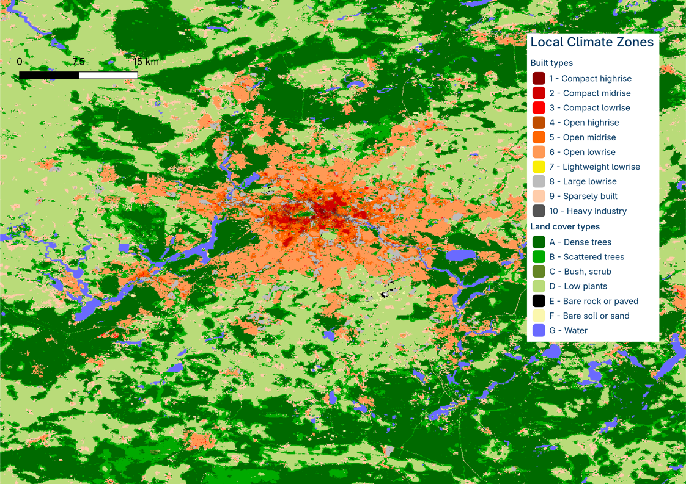
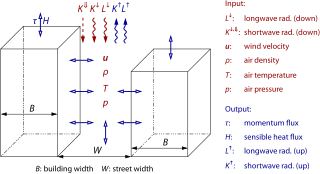
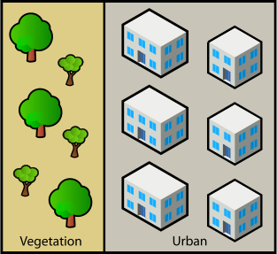
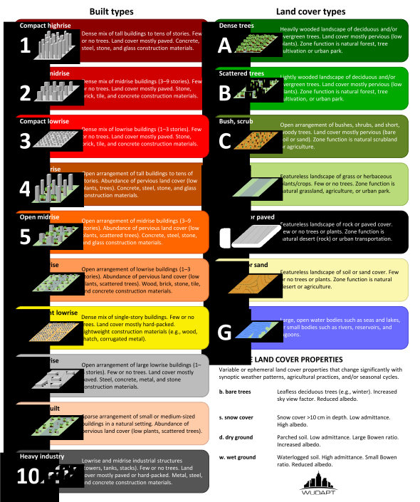

# Local Climate Zone based input for non-building resolving simulation

Getting a static driver just from a Local Climate Zone and a terrain height map

---

In the following, it is described how `palm_csd` can be used to create a static driver from Local Climate Zone (LCZ) input data for non-building-resolving PALM simulations with the urban parametrization scheme DCEP. Instead of the full data set required otherwise, only the input of an [LCZ map](yaml.md#lcz) and an [orography map](yaml.md#zt) is needed here. *Note that DCEP is currently under revision.*

## General settings

With [`lcz_input`](yaml.md#lcz_input), input from LCZ is enabled. Currently, only `full` instead of the default `None` is supported. All parameters are derived from LCZ data except orography height. Urban parameters for DCEP are generated when [`dcep`](yaml.md#dcep) is `True`. The vertical urban layer heights are set with [`z_uhl`](yaml.md#z_uhl) and the urban street directions with [`udir`](yaml.md#udir).

The LCZ can be provided with the [`lcz`](yaml.md#lcz) input consisting of either one layer with values from 1 to 17 for the 17 LCZ classes or a three-layer file with the RGB values of each LCZ class. The default RGB values are listed [below](#definition-of-parameter-values) and can be changed as described in the [customization section](#customization-of-lcz-parameters).

An example LCZ data set looks like this:
  
*LCZ map of Berlin, Germany from Demuzere et al. 2022a[^demuzere2022a].*

In addition to the LCZ input, palm_csd requires the [terrain height](terrain_height.md).

### Customization of LCZ parameters

This section contains settings to overwrite the default values assigned to each LCZ in the [`lcz` section](yaml.md#lcz-section). The values consist of the parameters assigned by the LCZ classification scheme and the PALM parameters. If it is a LCZ-related value, it is checked if it is within the defined valid range. The setting of a parameter is in the form of `type: value`. Use the names of classes and parameters as used in the tables in [the technical description](#definition-of-parameter-values) below. Here is an example:

```yml
lcz:
  water:
    b: 255
  open_lowrise:
    building_plan_area_fraction: 0.4
    impervious_plan_area_fraction: 0.2
    aspect_ratio: 0.75
```

Furthermore, the kind of average used when interpreting the average building height can be set with the [`height_geometric_mean`](yaml.md#height_geometric_mean) parameter. If this parameter is set to `True`, the geometric mean is used; if it is set to `False`, the arithmetic mean is used.

## Technical documentation

### DCEP

DCEP (Schubert et al. 2012)[^schubert2012] is an urban parametrization scheme that calculates the urban radiation and energy fluxes. Buildings are represented by infinitely long street canyons characterized by its building width $B$, street width $W$ and its building height distribution with the average $H$.



Urban impervious surfaces and vegetation are treated as separate tiles with grid cell fractions $f_\text{urb}$ and $1-f_\text{urb}$, respectively:



### Local Climate Zones

The Local Climate Zone (LCZ) classification (Stewart and Oke 2012)[^stewart2012] consists of the 17 classes.



(Demuzere et al. 2020)[^demuzere2020]

LCZ classifications are available for many urban areas in the World Urban Database and Access Portal Tool (Ching et al. 2018)[^ching2018].

#### Definition of parameter values

According to the definition of the LCZ classification, a valid minimum and maximum value of the following parameters are assigned to each LCZ class: mean building-height-to-street-width ratio (aspect ratio) $\lambda_S$, building surface fraction $\lambda_B$, impervious (without buildings) and pervious fraction $\lambda_I$ and $\lambda_V$, and average roughness element height $H$. For LCZ1 and LCZ4, a maximum building height was not defined. We follow Demuzere et al. (2022)[^demuzere2022] and set these values to 75m.

For the derivation of the required PALM input values, one value within the defined valid range of each parameter is used. This value can be set by the user. The default values are taken from the [w2w default values](https://github.com/matthiasdemuzere/w2w/blob/main/w2w/resources/LCZ_UCP_lookup.csv)[^demuzere2022].

Furthermore, for each LCZ class several PALM properties are assigned: a vegetation type, a water type and a leaf area index for winter and summer. These values can also be adjusted by the user. The vegetation type `interrupted_forest` is assigned to urban LCZ classes under the assumption of low and high vegetation in these areas. The only additionally required data input is the orography.

The following tables summarize the assigned values for each LCZ class. The tables also show the names of the classes and parameters to be used to customize the values.

|class |              index | |    $\lambda_S$   | | |    $\lambda_B$   | | |   $\lambda_I$    | | |    $\lambda_V$   | | |   $H$              | |     r |  g  |  b  |
|------|--------------------|-|------------------|-|-|------------------|-|-|------------------|-|-|------------------|-|-|--------------------|-|-------|-----|-----|
|      |                    | min | default | max  | min | default | max  | min | default | max  | min | default | max  |  min | default | max   |       |     |     |
|`compact_highrise` |     1 |   2.00 | 2.50 | None |   0.40 | 0.50 | 0.60 |   0.40 | 0.45 | 0.60 |   0.00 | 0.05 | 0.10 |   25.0 |  avg  | 75.00 |   140 |   0 |   0 |
|`compact_midrise` |      2 |   0.75 | 1.25 | 2.00 |   0.40 | 0.55 | 0.70 |   0.30 | 0.40 | 0.50 |   0.00 | 0.05 | 0.20 |   10.0 |  avg  | 25.00 |   209 |   0 |   0 |
|`compact_lowrise` |      3 |   0.75 | 1.25 | 1.50 |   0.40 | 0.55 | 0.70 |   0.20 | 0.35 | 0.50 |   0.00 | 0.10 | 0.30 |    3.0 |  avg  | 10.00 |   255 |   0 |   0 |
|`open_highrise` |        4 |   0.75 | 1.00 | 1.25 |   0.20 | 0.30 | 0.40 |   0.30 | 0.35 | 0.40 |   0.30 | 0.35 | 0.40 |   25.0 |  avg  | 75.00 |   191 |  77 |   0 |
|`open_midrise` |         5 |   0.30 | 0.50 | 0.75 |   0.20 | 0.30 | 0.40 |   0.30 | 0.40 | 0.50 |   0.20 | 0.30 | 0.40 |   10.0 |  avg  | 25.00 |   255 | 102 |   0 |
|`open_lowrise` |         6 |   0.30 | 0.50 | 0.75 |   0.20 | 0.30 | 0.40 |   0.20 | 0.35 | 0.50 |   0.30 | 0.35 | 0.60 |    3.0 |  avg  | 10.00 |   255 | 153 |  85 |
|`lightweight_lowrise` | 7 |   1.00 | 1.50 | 2.00 |   0.60 | 0.75 | 0.90 |   0.00 | 0.10 | 0.20 |   0.00 | 0.15 | 0.30 |    2.0 |  avg  |  4.00 |   250 | 238 |   5 |
|`large_lowrise` |        8 |   0.10 | 0.20 | 0.30 |   0.30 | 0.40 | 0.50 |   0.40 | 0.45 | 0.50 |   0.00 | 0.15 | 0.20 |    3.0 |  avg  | 10.00 |   188 | 188 | 188 |
|`sparsely_built` |       9 |   0.10 | 0.15 | 0.25 |   0.10 | 0.15 | 0.20 |   0.00 | 0.10 | 0.20 |   0.60 | 0.75 | 0.80 |    3.0 |  avg  | 10.00 |   255 | 204 | 170 |
|`heavy_industry` |      10 |   0.20 | 0.35 | 0.50 |   0.20 | 0.25 | 0.30 |   0.20 | 0.30 | 0.40 |   0.40 | 0.45 | 0.50 |    5.0 |  avg  | 15.00 |    85 |  85 |  85 |
|`dense_trees` |         11 |   1.00 | 2.00 | None,|   0.00 | 0.00 | 0.10 |   0.00 | 0.00 | 0.10 |   0.90 | 1.00 | 1.00 |    3.0 |  avg  | 30.00 |     0 | 106 |   0 |
|`scattered_trees` |     12 |   0.50 | 0.65 | 0.80 |   0.00 | 0.00 | 0.10 |   0.00 | 0.00 | 0.10 |   0.90 | 1.00 | 1.00 |    3.0 |  avg  | 15.00 |     0 | 170 |   0 |
|`bush_scrub` |          13 |   0.70 | 0.80 | 0.90 |   0.00 | 0.00 | 0.10 |   0.00 | 0.00 | 0.10 |   0.90 | 1.00 | 1.00 |    0.0 | 1.000 |  2.00 |   100 | 133 |  37 |
|`low_plants` |          14 |   0.90 | 1.00 | None,|   0.00 | 0.00 | 0.10 |   0.00 | 0.00 | 0.10 |   0.90 | 1.00 | 1.00 |    0.0 | 0.500 |  1.00 |   185 | 219 | 121 |
|`bare_rock_or_paved` |  15 |   0.90 | 1.00 | None,|   0.00 | 0.05 | 0.10 |   0.90 | 0.90 | 1.00 |   0.00 | 0.05 | 0.10 |    0.0 | 0.125 |  0.25 |     0 |   0 |   0 |
|`bare_soil_or_sand` |   16 |   0.90 | 1.00 | None,|   0.00 | 0.00 | 0.10 |   0.00 | 0.00 | 0.10 |   0.90 | 1.00 | 1.00 |    0.0 | 0.125 |  0.25 |   251 | 247 | 174 |
|`water` |               17 |   0.90 | 1.00 | None,|   0.00 | 0.00 | 0.10 |   0.00 | 0.00 | 0.10 |   0.90 | 1.00 | 1.00 |    0.0 | 0.000 |  0.00 |   106 | 106 | 205 |

with

- $\lambda_S$: `aspect_ratio`
- $\lambda_B$: `building_plan_area_fraction`
- $\lambda_I$: `impervious_plan_area_fraction`
- $\lambda_V$: `pervious_plan_area_fraction`
- $H$: `height_roughness_elements`

The following table shows the default values for the assigned PALM parameters:

| class                 | vegetation_type | water_type | lai_summer | lai_winter |
|-----------------------|-----------------|------------|------------|------------|
| compact_highrise      |             18  |     None   |     1.0    |    0.1     |
| compact_midrise       |             18  |     None   |     1.0    |    0.1     |
| compact_lowrise       |             18  |     None   |     1.0    |    0.1     |
| open_highrise         |             18  |     None   |     2.0    |    0.5     |
| open_midrise          |             18  |     None   |     2.0    |    0.5     |
| open_lowrise          |             18  |     None   |     2.0    |    0.5     |
| lightweight_lowrise  |             18  |     None   |     1.0    |    0.1     |
| large_lowrise         |             18  |     None   |     0.5    |    0.1     |
| sparsely_built        |             18  |     None   |     2.0    |    0.5     |
| heavy_industry        |             18  |     None   |     0.5    |    0.0     |
| dense_trees           |              7  |     None   |     4.0    |    0.8     |
| scattered_trees       |             18  |     None   |     2.0    |    0.5     |
| bush_scrub            |             16  |     None   |     1.0    |    0.1     |
| low_plants            |             16  |     None   |     1.0    |    0.1     |
| bare_rock_or_paved    |              1  |     None   |     0.0    |    0.0     |
| bare_soil_or_sand     |              1  |     None   |     0.0    |    0.0     |
| water                 |           None  |        1   |    None    |   None     |

#### Derivation of DCEP parameters

The input parameters required by DCEP are derived from the LCZ parameters as follows:

The urban fraction $f_\text{urb}$ of a grid cell is considered to be the total impervious fraction of a grid cell $f_\text{urb} = \lambda_B + \lambda_I$. The street width $W$ is calculated from the average building height and the aspect ratio with $W = H / \lambda_S$. The building width $B$ is given by $B = \lambda_B / \lambda_I \cdot W$.

We follow the approach of Demuzere et al. (2022)[^demuzere2022] as implemented in [w2w](https://github.com/matthiasdemuzere/w2w) in the calculation of the distribution of the building height: With the probability density function $f$ of a normal distribution with the mean value $H$ and a standard deviation $(H_\text{max} - H_\text{min})/4$, the fraction $p$ of buildings at a height $h$ is given by
$$
p(h) = \int_{h-\Delta H/2}^{h+\Delta H/2} f(x)\, dx \,,
$$
with $\Delta H$ being the layer thickness. Numerically, the integral is directly calculated with the cumulative distribution function of the given normal distribution using scipy[^virtanen2020]. Contrary to Demuzere et al. (2022)[^demuzere2022], the user can choose whether the arithmetic or the geometric mean of the building heights is to be used. In the original tool, the arithmetic average is used while the LCZ definition is based on the geometric mean[^stewart2012].

[^ching2018]: Ching, J., G. Mills, B. Bechtel, L. See, J. Feddema, X. Wang, C. Ren, et al. 2018. ‘WUDAPT: An Urban Weather, Climate, and Environmental Modeling Infrastructure for the Anthropocene’. Bulletin of the American Meteorological Society 99 (9): 1907–24. [doi: 10.1175/BAMS-D-16-0236.1](https://doi.org/10.1175/BAMS-D-16-0236.1).
[^demuzere2020]: Demuzere, Matthias, Steve Hankey, Gerald Mills, Wenwen Zhang, Tianjun Lu, and Benjamin Bechtel. ‘Combining Expert and Crowd-Sourced Training Data to Map Urban Form and Functions for the Continental US’. Scientific Data 7, no. 1 (11 August 2020): 264. [doi: 10.1038/s41597-020-00605-z](https://doi.org/10.1038/s41597-020-00605-z).
[^demuzere2022]: Demuzere, Matthias, Daniel Argüeso, Andrea Zonato, and Jonas Kittner. 2022. ‘W2W: A Python Package That Injects WUDAPT’s Local Climate Zone Information in WRF’. Journal of Open Source Software 7 (76): 4432. [doi: 10.21105/joss.04432](https://doi.org/10.21105/joss.04432).
[^demuzere2022a]: Demuzere, M., Kittner, J., Martilli, A., Mills, G., Moede, C., Stewart, I. D., van Vliet, J., and Bechtel, B. 2022. `A global map of local climate zones to support earth system modelling and urban-scale environmental science`. Earth Syst. Sci. Data, 14, 3835-3873, [doi: 10.5194/essd-14-3835-2022](https://doi.org/10.5194/essd-14-3835-2022).
[^schubert2012]: Schubert, Sebastian, Susanne Grossman-Clarke, and Alberto Martilli. 2012. ‘A Double-Canyon Radiation Scheme for Multi-Layer Urban Canopy Models’. Boundary-Layer Meteorology 145 (3): 439–68. [doi: 10.1007/s10546-012-9728-3](https://doi.org/10.1007/s10546-012-9728-3).
[^stewart2012]: Stewart, I. D., and T. R. Oke. 2012. ‘Local Climate Zones for Urban Temperature Studies’. Bulletin of the American Meteorological Society 93 (12): 1879–1900. [doi: 10.1175/BAMS-D-11-00019.1](https://doi.org/10.1175/BAMS-D-11-00019.1).
[^virtanen2020]: Virtanen, Pauli, Ralf Gommers, Travis E. Oliphant, Matt Haberland, Tyler Reddy, David Cournapeau, Evgeni Burovski, et al. 2020. ‘SciPy 1.0: Fundamental Algorithms for Scientific Computing in Python’. Nature Methods 17: 261–72. [doi: 10.1038/s41592-019-0686-2](https://doi.org/10.1038/s41592-019-0686-2).
