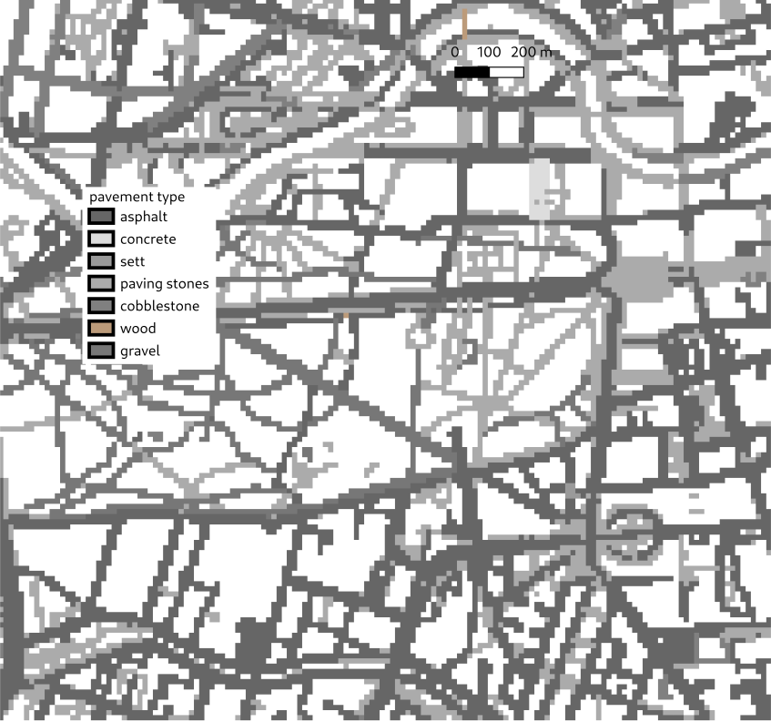
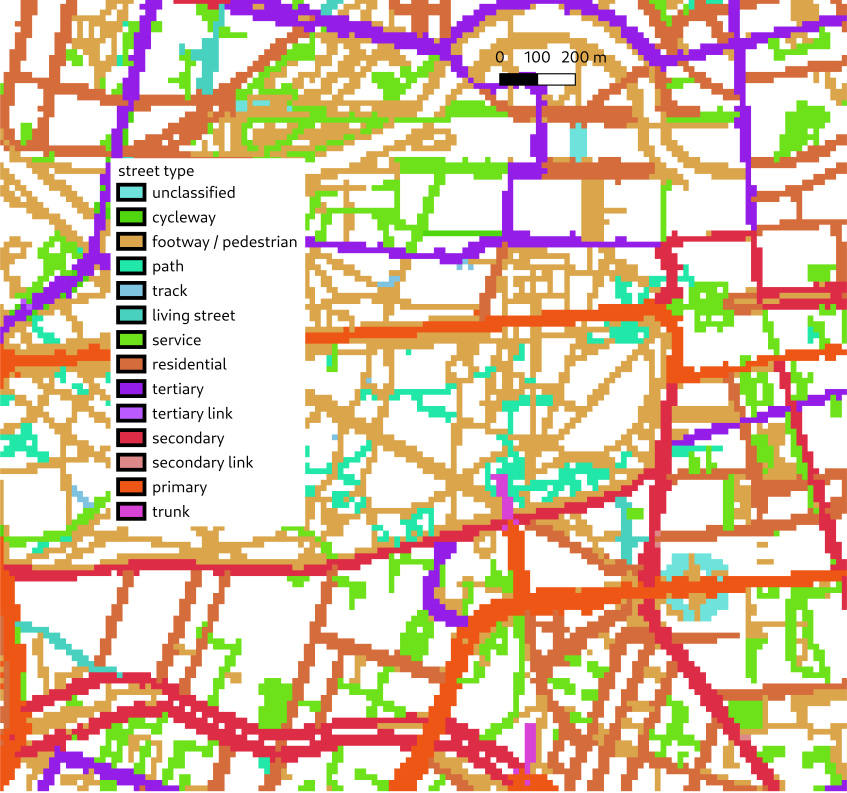
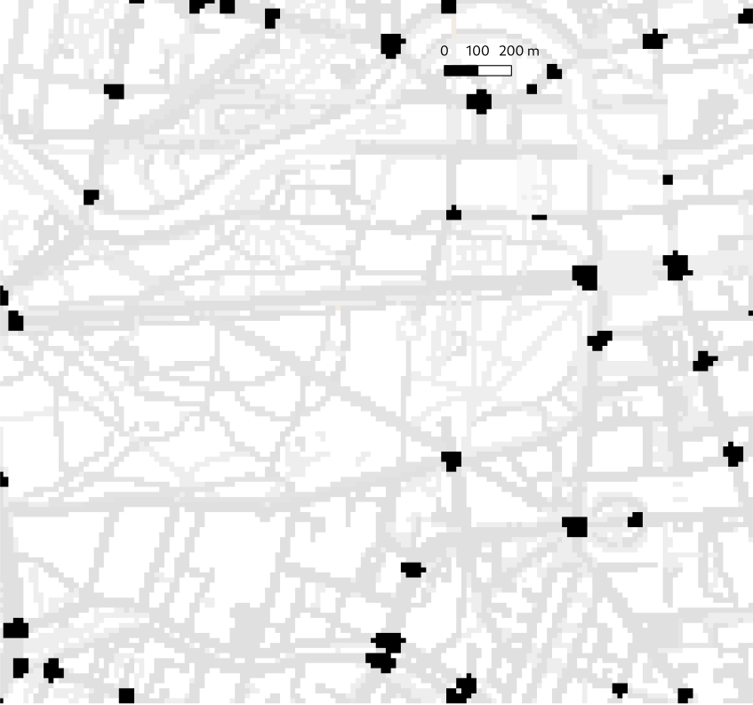

# Pavement and street

Impervious areas for the energy balance, chemistry and the multi agent system

---

Pavement is characterized by its [pavement type](types.md#pavement_type), which is used to determine energetic interaction with the surface and the atmosphere. The [street type](types.md#street_type) follows closely the OpenStreetMap classification and is used to determine the traffic emissions. Street crossings indicate the locations where pedestrians can cross streets and are used by the multi agent system.

## Pavement type

The [pavement type](types.md#pavement_type) can be supplied as vector polygon file(s) in [`surfaces`](yaml.md#surfaces) or as raster file [`pavement_type`](yaml.md#pavement_type).

In the vector case, the pavement type is defined by a column which only includes the numerical values of the pavement types.

```yaml
input:
  files:
    surfaces: pavement.shp
  columns:
    ptyp: pavement_type
```

  
*Surface polygons and their attributes. The pavement type is derived from the values of `BEZEICH`, which does not include the pavement type directly.*

Alternatively, the pavement type can be derived from a column that includes strings or values that need to be mapped to PALM's pavement types and that possibly also include other types.

```yaml
input_01:
  files:
    surfaces: Nutzung_Flaechen.shp
  columns:
    wassert: water_temperature
    BEZEICH:
      AX_FlaecheBesondererFunktionalerPraegung: asphalt_concrete_mix
      AX_Flugverkehr: concrete
      AX_IndustrieUndGewerbeflaeche: asphalt_concrete_mix
      AX_Platz: paving_stones
      AX_Strassenverkehr: asphalt_concrete_mix
      AX_Weg: fine_gravel
      AX_Wohnbauflaeche: asphalt_concrete_mix
```

  
*Pavement type raster.*

In the raster case, the raster consists directly of the numerical [pavement type values](types.md#pavement_type).

```yaml
input:
  files:
    pavement_type: pavement_type.tif
```

## Street type

Similar to the pavement type, the [street type](types.md#street_type) can be supplied as vector polygon file(s) in [`surfaces`](yaml.md#surfaces) or as raster file [`street_type`](yaml.md#street_type).

  
*Street type raster.*

In the raster case, the raster consists directly of the numerical [street type values](types.md#street_type).

```yaml
input:
  files:
    street_type: street_type.tif
```

## Street crossings

The only valid value for street crossing is `1` to indicate that pedestrians can cross the street. It can be supplied as vector polygon file(s) in [`surfaces`](yaml.md#surfaces) or as raster file [`street_crossings`](yaml.md#street_crossings).

  
*Street crossings raster with the street type in the background.*

In the raster case, the raster consists only of `1` or missing values.

```yaml
input:
  files:
    street_crossings: street_crossings.tif
```
