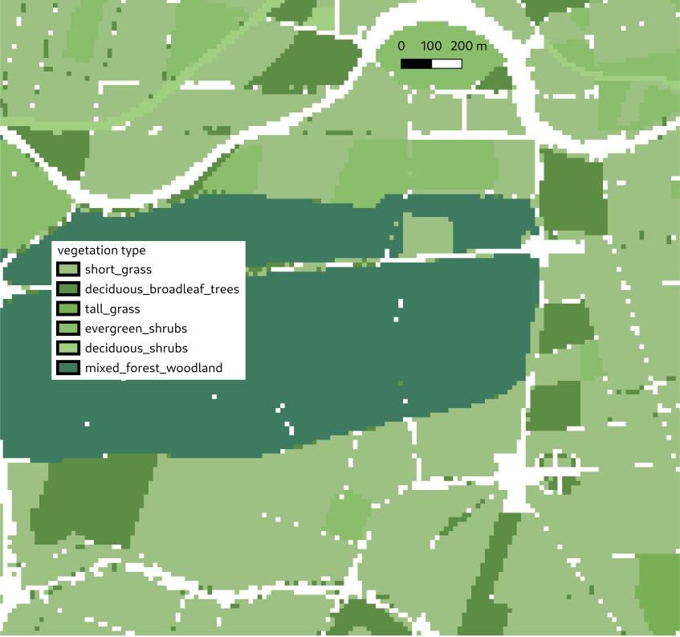
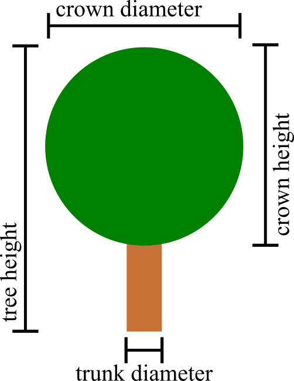
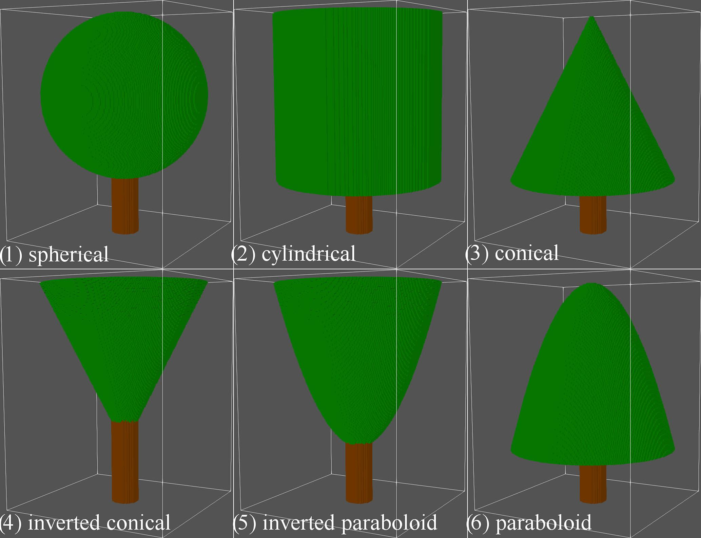
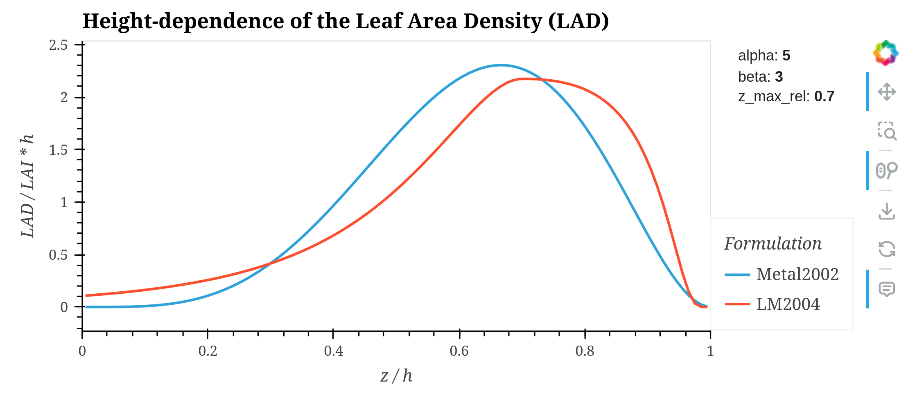

# Vegetation

Unresolved and resolved vegetation on the ground and roofs

---

PALM represents vegetation in two ways: as flat, vertically unresolved [vegetation types](types.md#vegetation_type) or as resolved vegetation described by the 3d distribution of the density of the vegetation. Unresolved vegetation is represented by vegetation types such as short_grass or evergreen_shrubs together with the leaf area index (LAI). The LAI with unit $\mathrm{m}^2/\mathrm{m}^2$ is defined as the one-sided area of leaves per ground area. The unresolved vegetation is used for vegetation that does not cover the full height of a grid cell. Resolved vegetation is defined by the leaf area density (LAD) and the basal area density (BAD) fields. The LAD with unit $\mathrm{m}^2/\mathrm{m}^3$ is defined as the one-sided area of leaves per volume, while the BAD is defined as the area of branches per volume. This approach is preferred for vegetation that covers at least the height of a grid cell.

The LAI can be reproduced from the LAD by vertically summing over the LAD multiplied by the vertical grid spacing $\Delta z=$[`dz`](yaml.md#dz):

$$
\mathrm{LAI} = \sum_k \mathrm{LAD}_k \, \mathrm{\Delta z} \, .
$$

## Unresolved vegetation

`palm_csd` requires the direct input of the different [vegetation types](types.md#vegetation_type) that PALM supports. Additionally, the LAI can be supplied, which is then used instead of the default values in PALM. Note that [vegetation types that represent high (grown) vegetation](types.md#high-vegetation) feature large roughness lengths ($z_0> 1\,\mathrm{m}$, $z_{0,h} > 1\,\mathrm{m}$) and are therefore not suitable for the vertical grid spacing typically used in building-resolving simulations. If the vertical grid spacing is close to or smaller than the roughness lengths, PALM will crash or does not provide meaningful results. Thus, if [`replace_high_vegetation_types`](yaml.md#replace_high_vegetation_types) is `True`, high vegetation types are replaced by resolved vegetation depending on the [`vegetation_height`](yaml.md#vegetation_height) and [`generate_vegetation_patches`](yaml.md#generate_vegetation_patches) as described below or by short_grass for the remaining pixels.

The vegetation type can be supplied as vector polygon file(s) in [`surfaces`](yaml.md#surfaces) or as raster file [`vegetation_type`](yaml.md#vegetation_type).

In the vector case, the vegetation type is defined by a column which only includes the numerical values of the vegetation types.

```yaml
input:
  files:
    surfaces: vegetation.shp
  columns:
    vtyp: vegetation_type
```

  
*Surface polygons and their attributes. The vegetation type is derived from the values of `BEZEICH`, which does not include the vegetation type directly.*

Alternatively, the vegetation type can be derived from a column that includes strings or values that need to be mapped to PALM's vegetation types and that possibly also include other types.

```yaml
input_01:
  files:
    surfaces: Nutzung_Flaechen.shp
  columns:
    BEZEICH:
      AX_Bahnverkehr: bare_soil
      AX_Friedhof: short_grass
      AX_Gehoelz: evergreen_shrubs
      AX_Halde: bare_soil
      AX_Heide: tall_grass
      AX_Landwirtschaft: crops_mixed_farming
      AX_Moor: bogs_marsches
      AX_Sumpf: bogs_marsches
      AX_TagebauGrubeSteinbruch: bare_soil
      AX_UnlandVegetationsloseFlaeche: bare_soil
      AX_Wald: mixed_forest_woodland
```

This maps the `BEZEICH` column with its values (e.g. `AX_Bahnverkehr`, `AX_Heide`, etc.) to the respective vegetation types.

  
*Vegetation type raster.*

In the raster case, the raster consists directly of the numerical [vegetation type values](types.md#vegetation_type).

```yaml
input:
  files:
    vegetation_type: vegetation_type.tif
```

## Resolved vegetation

`palm_csd` can generate LAD and BAD fields from two input variants: single tree input and vegetation patch input. In the single tree case, LAD and BAD are generated from detailed information of individual trees, while in the vegetation patch case, when detailed information is missing, LAD is generated from the vegetation height, LAI and patch type information.

### Single trees



Heldens et al. (2020) [^heldens2020]

The LAD and BAD fields are generated from single tree information if `generate_single_trees` is True. A single tree is defined by its height, crown diameter, trunk diameter, crown height (all in $\mathrm{m}$, left figure), shape and LAI.

  
*Single tree vector points and their attributes crown diameter (kronendurch), tree height (baumhoehe) and trunk diameter (stammdurch). The lighter points are street trees, the darker points are park trees.**

The input quantities can be specified as a or several vector point files [`trees`](yaml.md#trees) with the columns [`tree_height`](yaml.md#tree_height), [`tree_crown_diameter`](yaml.md#tree_crown_diameter), [`tree_lai`](yaml.md#tree_lai), [`tree_trunk_diameter`](yaml.md#tree_trunk_diameter), [`tree_shape`](yaml.md#tree_shape) or as separate corresponding raster files. In addition, the [`tree_type`](yaml.md#tree_type) column or input file give the species of the tree. Vector point input allows robust reprojection and adjustment to different output resolutions, while it is not guaranteed that these steps preserve single raster pixels. Note that as soon as a vector point is defined or a pixel in one of the raster inputs is defined, this point is assumed to be a single tree even if the other attributes are missing.

In case of vector point input, the [`tree_type`](yaml.md#tree_type) can also be derived from a column including the tree species name as text by setting [`tree_type_name`](yaml.md#tree_type_name). The content of this column is compared with the species name used in the [tree default table](#tree-database). If one of the tree attributes is missing, default values from [this table](#tree-database) are used. Note that if [`use_vegetation_height_for_trees`](yaml#use_vegetation_height_for_trees) is `True`, the [`vegetation height`](yaml.md#vegetation_height) field is used in the case of a missing tree height. Similarly, if [`use_lai_for_trees`](yaml#use_lai_for_trees) is `True`, the LAI field is used in the case of a missing tree LAI. If the LAI field's value at the tree location is also missing and [`estimate_lai_from_vegetation_height`](yaml.md#estimate_lai_from_vegetation_height) is `True`, the LAI is estimated from the vegetation height $h$ using

$$
\mathrm{LAI} = \lambda_\mathrm{LAI} \cdot h
$$

with the parameter $\lambda_\mathrm{LAI}$ as defined in [`lai_per_vegetation_height`](yaml.md#lai_per_vegetation_height). If[`estimate_lai_from_vegetation_height`](yaml.md#estimate_lai_from_vegetation_height) is `False`, either [`lai_low_vegetation_default`](yaml.md#lai_low_vegetation_default) or [`lai_high_vegetation_default`](yaml.md#lai_high_vegetation_default) is used, depending on [`height_high_vegetation_lower_threshold`](yaml.md#height_high_vegetation_lower_threshold) and if these values are defined.

For a vector point input with two separate input files the input section could look like this:

```yaml
input_1:
  trees:
    - trees_street.shp
    - trees_park.shp
  columns:
    baumhoehe: tree_height
    kronendurch: tree_crown_diameter
    stammdurch: tree_trunk_diameter
    art_bot: tree_type_name
```

### Vegetation patches

In order to capture tree-like vegetation for areas without single tree information, `palm_csd` generates LAD cells from vegetation patches if [`generate_vegetation_patches`](yaml.md#generate_vegetation_patches) is `True`; BAD cells are currently not generated. A vegetation patch is identified for each pixel if one of the following conditions is met:

1. The [`vegetation height`](yaml.md#vegetation_height) is larger or equal than [a fraction of the vertical grid spacing](yaml.md#height_rel_resolved_vegetation_lower_threshold).
2. If [`replace_high_vegetation_types`](yaml.md#replace_high_vegetation_types) is True, a [high vegetation vegetation type](types.md#high-vegetation-vegetation_types) with either undefined vegetation height or a vegetation height larger or equal than [a fraction of the vertical grid spacing](yaml.md#height_rel_resolved_vegetation_lower_threshold).
3. A defined patch type with either undefined vegetation height or a vegetation height larger or equal than [a fraction of the vertical grid spacing](yaml.md#height_rel_resolved_vegetation_lower_threshold).

  
*Vegetation height raster.*

The vegetation height can be supplied as a raster file [`vegetation_height`](yaml.md#vegetation_height) or as a column in a vector polygon file mapped to [`vegetation_height`](yaml.md#vegetation_height). For each identified vegetation patch, if [`vegetation_height`](yaml.md#vegetation_height) is not defined, [`patch_height_default`](yaml.md#patch_height_default) is assumed.

The [`vegetation_type`](yaml.md#vegetation_type) can be supplied, as discussed above, as raster, vector polygon file or as a column in a vector polygon file mapped to `vegetation_type`.

The patch type is the tree type of the vegetation patch. It can be supplied as a column in a vector polygon file mapped to [`patch_type`](yaml.md#patch_type) or as a raster file [`patch_type`](yaml.md#patch_type). If the patch type is missing, the negative vegetation type is used in case of a high vegetation vegetation type. If the pixel is not of a high vegetation vegetation type, tree type 0 is used.

The LAI can be supplied as a column in a vector polygon file mapped to [`lai`](yaml.md#lai) or as the raster file [`lai`](yaml.md#lai). If LAI values are missing and [`estimate_lai_from_vegetation_height`](yaml.md#estimate_lai_from_vegetation_height) is `True`, the LAI is estimated from the vegetation height $h$ using

$$
\mathrm{LAI} = \lambda_\mathrm{LAI} \cdot h
$$

with the parameter $\lambda_\mathrm{LAI}$ as defined in [`lai_per_vegetation_height`](yaml.md#lai_per_vegetation_height). If[`estimate_lai_from_vegetation_height`](yaml.md#estimate_lai_from_vegetation_height) is `False`, either [`lai_low_vegetation_default`](yaml.md#lai_low_vegetation_default) or [`lai_high_vegetation_default`](yaml.md#lai_high_vegetation_default) is used, depending on [`height_high_vegetation_lower_threshold`](yaml.md#height_high_vegetation_lower_threshold) and if these values are defined.

The threshold fraction of the vertical grid spacing can be adjusted with [`height_rel_resolved_vegetation_lower_threshold`](yaml.md#height_rel_resolved_vegetation_lower_threshold).

For each identified vegetation patch pixel, a continuous vertical LAD profile is assumed according to the chosen [`lad_method`](yaml.md#lad_method) and discretized for the PALM grid. `Metal2003` for the profile in Markkanen et al. (2003)[^markkanenetal2003] and `LM2004` for the profile in Lalic and Mihailovic (2004)[^lalicmihailovic2004] are implemented. The profiles and their parameters are detailed below.

With this, the configuration for vegetation patches could look like this:

```yaml
settings:
  lad_alpha: 5.0
  lad_beta: 3.0
  lad_method: Metal2003
  lai_high_vegetation_default: 6.0
  lai_low_vegetation_default: 3.0
  patch_height_default: 10.0
input:
  files:
    lai: Berlin_leaf_area_index.tif
    patch_type: Berlin_patch_type.tif
    vegetation_height: Berlin_vegetation_patch_height.tif
    vegetation_type: Berlin_vegetation_type.tif
domain:
  generate_vegetation_patches: True
```

#### LAD profiles

For `lad_method: Metal2003`, the assumed profile (up to a normalization constant) is given by

$$
\mathrm{LAD}_{\mathrm{Metal2003}}(z) \propto \left(\frac{z}{h}\right)^{\alpha-1} \left(1-\frac{z}{h}\right)^{\beta-1} \,
$$

where $\alpha$ ([`lad_alpha`](yaml.md#lad_alpha)) and $\beta$ ([`lad_beta`](yaml.md#lad_beta)) are the shape parameters of the profile.

For `lad_method: LM2004`, the assumed vertical continuous LAD is given by

$$
\mathrm{LAD}_{\mathrm{LM2004}}(z) = L_\mathrm{m} \left(\frac{h-z_\mathrm{m}}{h-z}\right)^n \exp\mathopen{}\left[n\left(1-\frac{h-z_\mathrm{m}}{h-z}\right)\right]
$$

with

$$
n = \begin{cases}
    6   & \text{for } 0 \leq z < z_\mathrm{m} \\
    0.5 & \text{for } z_\mathrm{m} \leq z \leq h
\end{cases} \, .
$$

Here, $z_\mathrm{m}$ ([`lad_z_max_rel`](yaml.md#lad_z_max_rel)) is the relative height of the highest LAD value $L_m$ and a parameter of this profile. $L_m$ is given by the normalization of the profile to the LAI.

The parameters of these profiles, in particular `lad_alpha` and `lad_beta`, are hard to interpret. Thus, we provide an interactive tool to visualize the different profiles the effect of their parameters in `tools/plot_lad_profiles.py`. In addition to the Python packages installed for `palm_csd`, it requires the `xarray` and `hvplot` packages. The tool can be executed from the command line with

```bash
python3 tools/lad_patch_configurator.py
```



In order to discretize the LAD profile for the PALM grid, the LAD is integrated over the vertical grid spacing $\Delta z$ and averaged over the grid cell height $z_k$ to $z_{k+1}$, where $z_k$ is the lower height of the grid cell and $z_{k+1}$ is the upper height of the grid cell. The resulting LAD value for each grid cell is given by

$$
\mathrm{LAD}_k = \frac{1}{\Delta z} \int_{z_k}^{z_{k+1}} \mathrm{LAD}(z) \, \mathrm{d}z \,.
$$

[^heldens2020]: Heldens, W., Burmeister, C., Kanani-Sühring, F., Maronga, B., Pavlik, D., Sühring, M., Zeidler, J., Esch, T. 2020. ‘Geospatial Input Data for the PALM Model System 6.0: Model Requirements, Data Sources and Processing’. Geoscientific Model Development 13 (11): 5833–73. [doi: 10.5194/gmd-13-5833-2020](https://doi.org/10.5194/gmd-13-5833-2020).
[^lalicmihailovic2004]: Lalic, B. and Mihailovic, D. T. (2004): An Empirical Relation Describing Leaf-Area Density inside the Forest for Environmental Modeling. Journal of Applied Meteorology, vol. 43, no. 4, pp. 641–645, [doi: 10.1175/1520-0450(2004)043<0641:AERDLD>2.0.CO;2](https://doi.org/10.1175/1520-0450(2004)043<0641:AERDLD>2.0.CO;2).
[^markkanenetal2003]: Markkanen, T., Rannik, Ü., Marcolla, B., Cescatti, A. and Vesala, T. (2003): Footprints and Fetches for Fluxes over Forest Canopies with Varying Structure and Density. Boundary-Layer Meteorology 106, 437–459, [doi: 10.1023/A:1021261606719](https://doi.org/10.1023/A:1021261606719).

## Vegetation of roofs and walls

Vegetation on roofs can be added using the building parameters [`building_fraction`](yaml.md#building_fraction) and [`building_lai`](yaml.md#building_lai) for wall and roof surfaces as described in the [respective building section](buildings.md#setting-of-building-parameters). For `building_fraction`,  the values for the [`building_surface_type`](types#building_surface_type)s `green_gfl`, `green_agfl` and `green_roof` can be adjusted. For `building_lai`, the values for the [`building_surface_level`](types#building_surface_level)s `gfl`, `agfl` and `roof` can be set.

If [`use_lai_for_roofs`](yaml.md#use_lai_for_roofs) is `True`, the general LAI input is used for vegetation on roofs if the specific [`building_lai`](yaml.md#building_lai) input for roof surfaces is not set.

An example configuration using polygon input could look like this:

```yaml
input_tiergarten:
  files:
    surfaces: buildings.shp
  columns:
    bfrac_gr_r: building_fraction_green_roof
    bfrac_wa_r: building_fraction_wall_roof
domain_root:
  building_fraction:
    wall_agfl: 0.8
    green_agfl: 0.2
```

## Tree database

Default values for trees if individual parameters are not provided. Default data is derived as mean values from the tree database for Berlin, Germany.

| Index | Species | Shape | Crown height/width ratio(\*) | Crown diameter (m) | Height (m) | LAI summer(\*) | LAI winter(\*) | Height of maximum LAD (m) | LAD/BAD ratio(\*) | DBH (m) |
|-------|---------|-------|------------------------------|--------------------|------------|----------------|----------------|---------------------------|-------------------|---------|
|  0 | Default|         1.0 | 1.0 | 4.0| 12.0| 3.0| 0.8| 0.6| 0.025| 0.35|
|  1 | Abies|           3.0 | 1.0 | 4.0| 12.0| 3.0| 0.8| 0.6| 0.025| 0.80|
|  2 | Acer|            1.0 | 1.0 | 7.0| 12.0| 3.0| 0.8| 0.6| 0.025| 0.80|
|  3 | Aesculus|        1.0 | 1.0 | 7.0| 12.0| 3.0| 0.8| 0.6| 0.025| 1.00|
|  4 | Ailanthus|       1.0 | 1.0 | 8.5| 13.5| 3.0| 0.8| 0.6| 0.025| 1.30|
|  5 | Alnus|           3.0 | 1.0 | 6.0| 16.0| 3.0| 0.8| 0.6| 0.025| 1.20|
|  6 | Amelanchier|     1.0 | 1.0 | 3.0|  4.0| 3.0| 0.8| 0.6| 0.025| 1.20|
|  7 | Betula|          1.0 | 1.0 | 6.0| 14.0| 3.0| 0.8| 0.6| 0.025| 0.30|
|  8 | Buxus|           1.0 | 1.0 | 4.0|  4.0| 3.0| 0.8| 0.6| 0.025| 0.90|
|  9 | Calocedrus|      3.0 | 1.0 | 5.0| 10.0| 3.0| 0.8| 0.6| 0.025| 0.50|
| 10 | Caragana|        1.0 | 1.0 | 3.5|  6.0| 3.0| 0.8| 0.6| 0.025| 0.90|
| 11 | Carpinus|        1.0 | 1.0 | 6.0| 10.0| 3.0| 0.8| 0.6| 0.025| 0.70|
| 12 | Carya|           1.0 | 1.0 | 5.0| 17.0| 3.0| 0.8| 0.6| 0.025| 0.80|
| 13 | Castanea|        1.0 | 1.0 | 4.5|  7.0| 3.0| 0.8| 0.6| 0.025| 0.80|
| 14 | Catalpa|         1.0 | 1.0 | 5.5|  6.5| 3.0| 0.8| 0.6| 0.025| 0.70|
| 15 | Cedrus|          1.0 | 1.0 | 8.0| 13.0| 3.0| 0.8| 0.6| 0.025| 0.80|
| 16 | Celtis|          1.0 | 1.0 | 6.0|  9.0| 3.0| 0.8| 0.6| 0.025| 0.80|
| 17 | Cercidiphyllum|  1.0 | 1.0 | 3.0|  6.5| 3.0| 0.8| 0.6| 0.025| 0.80|
| 18 | Cercis|          1.0 | 1.0 | 2.5|  7.5| 3.0| 0.8| 0.6| 0.025| 0.90|
| 19 | Chamaecyparis|   5.0 | 1.0 | 3.5|  9.0| 3.0| 0.8| 0.6| 0.025| 0.70|
| 20 | Cladrastis|      1.0 | 1.0 | 5.0| 10.0| 3.0| 0.8| 0.6| 0.025| 0.80|
| 21 | Cornus|          1.0 | 1.0 | 4.5|  6.5| 3.0| 0.8| 0.6| 0.025| 1.20|
| 22 | Corylus|         1.0 | 1.0 | 5.0|  9.0| 3.0| 0.8| 0.6| 0.025| 0.40|
| 23 | Cotinus|         1.0 | 1.0 | 4.0|  4.0| 3.0| 0.8| 0.6| 0.025| 0.70|
| 24 | Crataegus|       3.0 | 1.0 | 3.5|  6.0| 3.0| 0.8| 0.6| 0.025| 1.40|
| 25 | Cryptomeria|     3.0 | 1.0 | 5.0| 10.0| 3.0| 0.8| 0.6| 0.025| 0.50|
| 26 | Cupressocyparis| 3.0 | 1.0 | 3.0|  8.0| 3.0| 0.8| 0.6| 0.025| 0.40|
| 27 | Cupressus|       3.0 | 1.0 | 5.0|  7.0| 3.0| 0.8| 0.6| 0.025| 0.40|
| 28 | Cydonia|         1.0 | 1.0 | 2.0|  3.0| 3.0| 0.8| 0.6| 0.025| 0.90|
| 29 | Davidia|         1.0 | 1.0 | 10.0| 14.0| 3.0| 0.8| 0.6| 0.025| 0.40|
| 30 | Elaeagnus|       1.0 | 1.0 | 6.5|  6.0| 3.0| 0.8| 0.6| 0.025| 1.20|
| 31 | Euodia|          1.0 | 1.0 | 4.5|  6.0| 3.0| 0.8| 0.6| 0.025| 0.90|
| 32 | Euonymus|        1.0 | 1.0 | 4.5|  6.0| 3.0| 0.8| 0.6| 0.025| 0.60|
| 33 | Fagus|           1.0 | 1.0 | 10.0| 12.5| 3.0| 0.8| 0.6| 0.025| 0.50|
| 34 | Fraxinus|        1.0 | 1.0 | 5.5| 10.5| 3.0| 0.8| 0.6| 0.025| 1.60|
| 35 | Ginkgo|          3.0 | 1.0 | 4.0|  8.5| 3.0| 0.8| 0.6| 0.025| 0.80|
| 36 | Gleditsia|       1.0 | 1.0 | 6.5| 10.5| 3.0| 0.8| 0.6| 0.025| 0.60|
| 37 | Gymnocladus|     1.0 | 1.0 | 5.5| 10.0| 3.0| 0.8| 0.6| 0.025| 0.80|
| 38 | Hippophae|       1.0 | 1.0 | 9.5|  8.5| 3.0| 0.8| 0.6| 0.025| 0.80|
| 39 | Ilex|            1.0 | 1.0 | 4.0|  7.5| 3.0| 0.8| 0.6| 0.025| 0.80|
| 40 | Juglans|         1.0 | 1.0 | 7.0|  9.0| 3.0| 0.8| 0.6| 0.025| 0.50|
| 41 | Juniperus|       5.0 | 1.0 | 3.0|  7.0| 3.0| 0.8| 0.6| 0.025| 0.90|
| 42 | Koelreuteria|    1.0 | 1.0 | 3.5|  5.5| 3.0| 0.8| 0.6| 0.025| 0.50|
| 43 | Laburnum|        1.0 | 1.0 | 3.0|  6.0| 3.0| 0.8| 0.6| 0.025| 0.60|
| 44 | Larix|           3.0 | 1.0 | 7.0| 16.5| 3.0| 0.8| 0.6| 0.025| 0.60|
| 45 | Ligustrum|       1.0 | 1.0 | 3.0|  6.0| 3.0| 0.8| 0.6| 0.025| 1.10|
| 46 | Liquidambar|     3.0 | 1.0 | 3.0|  7.0| 3.0| 0.8| 0.6| 0.025| 0.30|
| 47 | Liriodendron|    3.0 | 1.0 | 4.5|  9.5| 3.0| 0.8| 0.6| 0.025| 0.50|
| 48 | Lonicera|        1.0 | 1.0 | 7.0|  9.0| 3.0| 0.8| 0.6| 0.025| 0.70|
| 49 | Magnolia|        1.0 | 1.0 | 3.0|  5.0| 3.0| 0.8| 0.6| 0.025| 0.60|
| 50 | Malus|           1.0 | 1.0 | 4.5|  5.0| 3.0| 0.8| 0.6| 0.025| 0.30|
| 51 | Metasequoia|     5.0 | 1.0 | 4.5| 12.0| 3.0| 0.8| 0.6| 0.025| 0.50|
| 52 | Morus|           1.0 | 1.0 | 7.5| 11.5| 3.0| 0.8| 0.6| 0.025| 1.00|
| 53 | Ostrya|          1.0 | 1.0 | 2.0|  6.0| 3.0| 0.8| 0.6| 0.025| 1.00|
| 54 | Parrotia|        1.0 | 1.0 | 7.0|  7.0| 3.0| 0.8| 0.6| 0.025| 0.30|
| 55 | Paulownia|       1.0 | 1.0 | 4.0|  8.0| 3.0| 0.8| 0.6| 0.025| 0.40|
| 56 | Phellodendron|   1.0 | 1.0 | 13.5| 13.5| 3.0| 0.8| 0.6| 0.025| 0.50|
| 57 | Picea|           3.0 | 1.0 | 3.0| 13.0| 3.0| 0.8| 0.6| 0.025| 0.90|
| 58 | Pinus|           3.0 | 1.0 | 6.0| 16.0| 3.0| 0.8| 0.6| 0.025| 0.80|
| 59 | Platanus|        1.0 | 1.0 | 10.0| 14.5| 3.0| 0.8| 0.6| 0.025| 1.10|
| 60 | Populus|         1.0 | 1.0 | 9.0| 20.0| 3.0| 0.8| 0.6| 0.025| 1.40|
| 61 | Prunus|          1.0 | 1.0 | 5.0|  7.0| 3.0| 0.8| 0.6| 0.025| 1.60|
| 62 | Pseudotsuga|     3.0 | 1.0 | 6.0| 17.5| 3.0| 0.8| 0.6| 0.025| 0.70|
| 63 | Ptelea|          1.0 | 1.0 | 5.0|  4.0| 3.0| 0.8| 0.6| 0.025| 1.10|
| 64 | Pterocaria|      1.0 | 1.0 | 10.0| 12.0| 3.0| 0.8| 0.6| 0.025| 0.50|
| 65 | Pterocarya|      1.0 | 1.0 | 11.5| 14.5| 3.0| 0.8| 0.6| 0.025| 1.60|
| 66 | Pyrus|           3.0 | 1.0 | 3.0|  6.0| 3.0| 0.8| 0.6| 0.025| 1.80|
| 67 | Quercus|         1.0 | 1.0 | 8.0| 14.0| 3.1| 0.1| 0.6| 0.025| 0.40|
| 68 | Rhamnus|         1.0 | 1.0 | 4.5|  4.5| 3.0| 0.8| 0.6| 0.025| 1.30|
| 69 | Rhus|            1.0 | 1.0 | 7.0|  5.5| 3.0| 0.8| 0.6| 0.025| 0.50|
| 70 | Robinia|         1.0 | 1.0 | 4.5| 13.5| 3.0| 0.8| 0.6| 0.025| 0.50|
| 71 | Salix|           1.0 | 1.0 | 7.0| 14.0| 3.0| 0.8| 0.6| 0.025| 1.10|
| 72 | Sambucus|        1.0 | 1.0 | 8.0|  6.0| 3.0| 0.8| 0.6| 0.025| 1.40|
| 73 | Sasa|            1.0 | 1.0 | 10.0| 25.0| 3.0| 0.8| 0.6| 0.025| 0.60|
| 74 | Sequoiadendron|  5.0 | 1.0 | 5.5| 10.5| 3.0| 0.8| 0.6| 0.025| 1.60|
| 75 | Sophora|         1.0 | 1.0 | 7.5| 10.0| 3.0| 0.8| 0.6| 0.025| 1.40|
| 76 | Sorbus|          1.0 | 1.0 | 4.0|  7.0| 3.0| 0.8| 0.6| 0.025| 1.10|
| 77 | Syringa|         1.0 | 1.0 | 4.5|  5.0| 3.0| 0.8| 0.6| 0.025| 0.60|
| 78 | Tamarix|         1.0 | 1.0 | 6.0|  7.0| 3.0| 0.8| 0.6| 0.025| 0.50|
| 79 | Taxodium|        5.0 | 1.0 | 6.0| 16.5| 3.0| 0.8| 0.6| 0.025| 0.60|
| 80 | Taxus|           2.0 | 1.0 | 5.0|  7.5| 3.0| 0.8| 0.6| 0.025| 1.50|
| 81 | Thuja|           3.0 | 1.0 | 3.5|  9.0| 3.0| 0.8| 0.6| 0.025| 0.70|
| 82 | Tilia|           3.0 | 1.0 | 7.0| 12.5| 3.0| 0.8| 0.6| 0.025| 0.70|
| 83 | Tsuga|           3.0 | 1.0 | 6.0| 10.5| 3.0| 0.8| 0.6| 0.025| 1.10|
| 84 | Ulmus|           1.0 | 1.0 | 7.5| 14.0| 3.0| 0.8| 0.6| 0.025| 0.80|
| 85 | Zelkova|         1.0 | 1.0 | 4.0|  5.5| 3.0| 0.8| 0.6| 0.025| 1.20|
| 86 | Zenobia|         1.0 | 1.0 | 5.0|  5.0| 3.0| 0.8| 0.6| 0.025| 0.40|

(*) Preliminary parameter.
