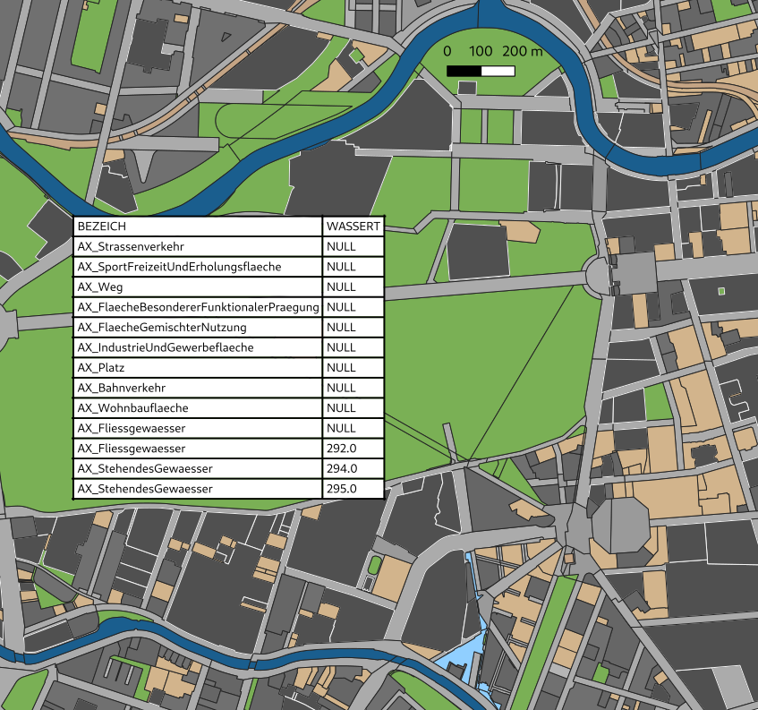
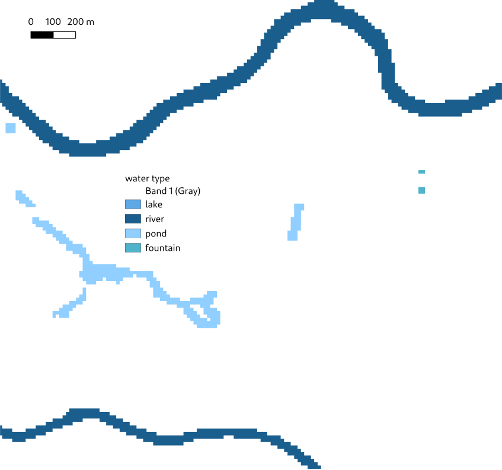

# Water surfaces

Water surfaces with their temperatures

---

Water surfaces are characterized by their [water type](types.md#water_type) and their water surface temperature in K. Both quantities can be supplied as vector polygon file(s) in [`surfaces`](yaml.md#surfaces) or as raster file [`water_type`](yaml.md#water_type) and [`water_temperature`](yaml.md#water_temperature).

In the vector case, the water type is defined by a column which only includes the numerical values of the water types and/or the water temperature.

```yaml
input:
  files:
    surfaces: water.shp
  columns:
    vtyp: water_type
    wtemp: water_temperature
```

  
*Surface polygons and their attributes. The water type is derived from the `BEZEICH` values, which do not directly include the water type.*

Alternatively, the water type can be derived from a column that includes strings or values that need to be mapped to PALM's water types and that possibly also include other types. In the following example, the water temperature is taken directly from another column.

```yaml
input_01:
  files:
    surfaces: Nutzung_Flaechen.shp
  columns:
    wassert: water_temperature
    BEZEICH:
      AX_Fliessgewaesser: river
      AX_Hafenbecken: river
      AX_Schiffsverkehr: river
      AX_StehendesGewaesser: lake
```

  
*Water type raster.*

In the raster case, the raster consists directly of the numerical [water type values](types.md#water_type) and [water temperature values](types.md#water_temperature).

The water temperature can also be supplied in the domain configuration on per-type basis using the [`water_temperature`](yaml.md#water_temperature-1) parameter. One can either set the water temperature for all water types using `water_temperature: 293.15`, or set it for each water type individually using the type name:

```yaml
input:
  files:
    water_type: water_type.tif
    water_temperature: water_temperature.tif
domain:
  water_temperature:
    river: 293.15
    lake: 293.15
```
